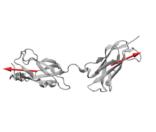

# SI-intimin

Supplementary simulation data, scripts and input files for the scientific article _The extracellular juncture domains in the intimin passenger adopt a constitutively extended conformation inducing restraints to its sphere of action_ by Julia Weikum, Alina Kulakova, Giulio Tesei, Shogo Yoshimoto, Line Vejby Jægerum, Monika Schütz, Katsutoshi Hori, Marie Skepö, Pernille Harris, Jack C. Leo and J. Preben Morth.



To open the Notebooks, install python via [Miniconda](https://conda.io/miniconda.html) and make sure all required packages are loaded
by issuing the following terminal commands

```bash
    conda env create -f environment.yml
    source activate intimin
    jupyter-notebook
```
